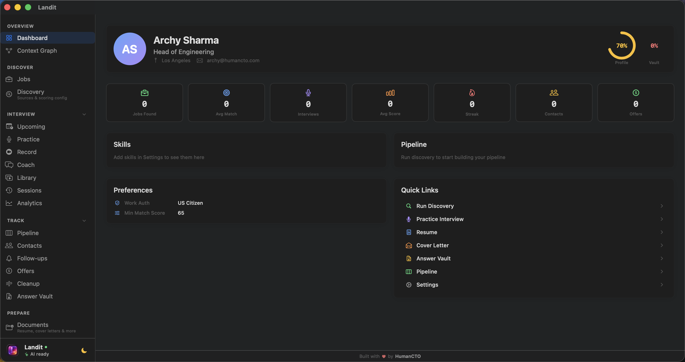
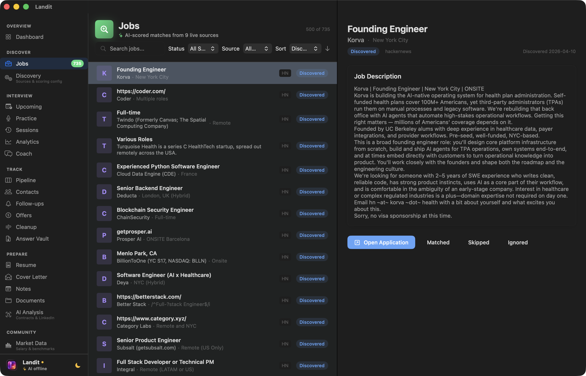
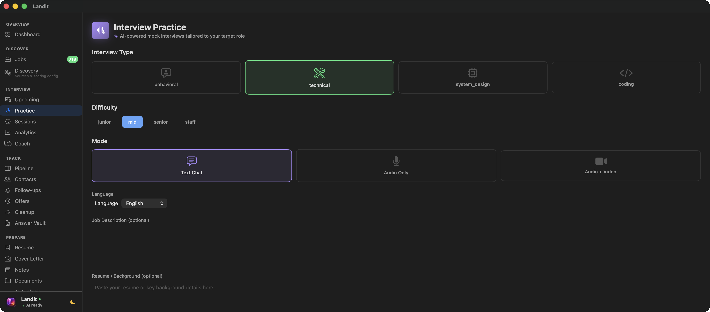
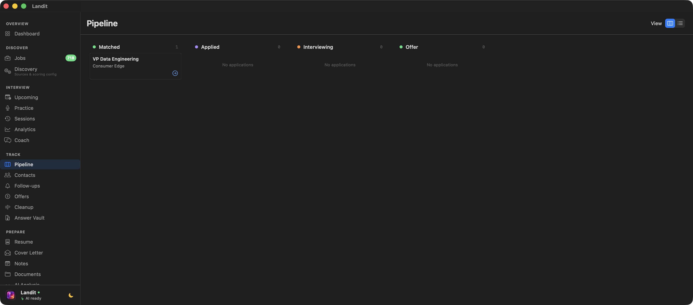
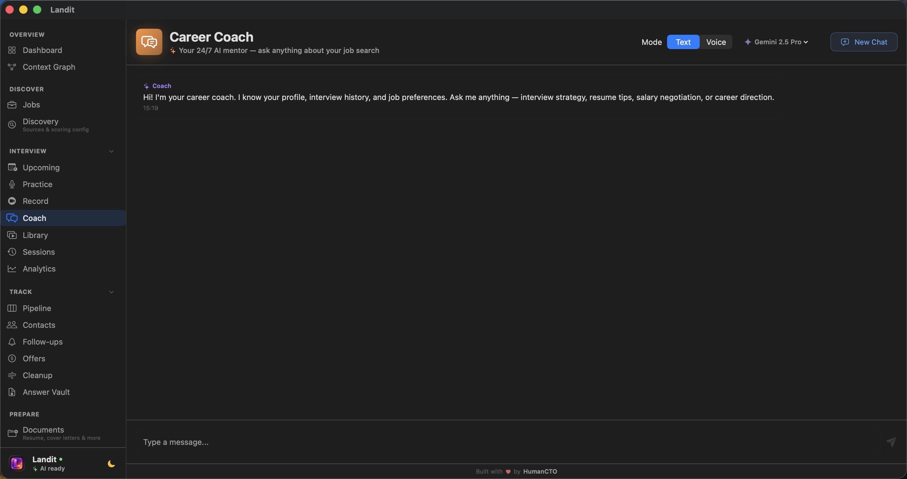
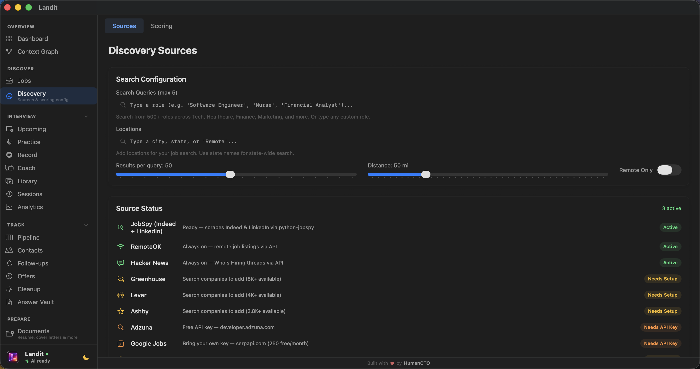
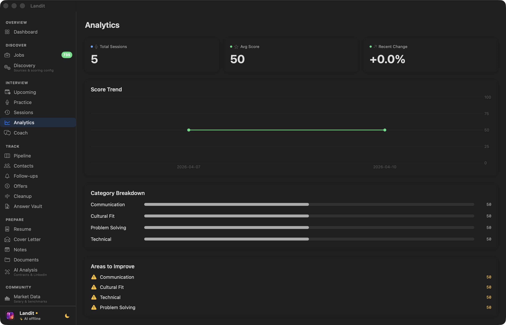
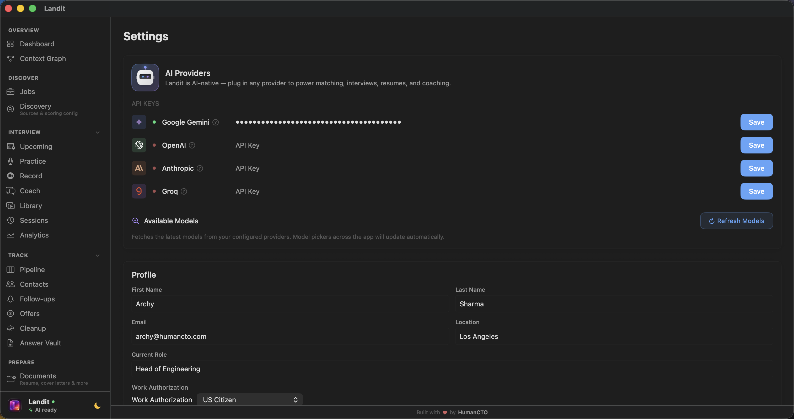

<div align="center">


# Landit

### AI-Powered Career Command Center for macOS

Find jobs. Ace interviews. Track everything. Land the offer.

[](https://github.com/humancto/landit-releases/releases/latest)
&nbsp;
[](https://github.com/humancto/landit-releases/releases/latest)
&nbsp;
[](https://github.com/humancto/landit-releases)

[](https://humancto.github.io/landit-releases/)
[](https://github.com/humancto/landit-releases/releases)
[](https://github.com/humancto/landit-releases/releases)
[]()
[]()

---

**7+ Job Sources** &bull; **Live AI Interviews** &bull; **Video Recording Studio** &bull; **Context Graph** &bull; **Pipeline Tracking** &bull; **Career Coach** &bull; **100% Local**

</div>

---



## Why Landit?

Most job search tools make you juggle 10 browser tabs. Landit replaces all of them with one native Mac app that works offline, keeps your data local, and uses AI to automate the tedious parts.

> **Discover** jobs from Indeed, LinkedIn, Greenhouse, Lever, Ashby, RemoteOK, HN, and Adzuna in one search. **Score** every match against your resume. **Practice** with live AI interviews. **Track** your pipeline. **Land** the offer.

---

## Screenshots

### AI-Scored Job Discovery

> Search 7+ sources simultaneously. Every job scored 0-100 against your resume.



### Live AI Mock Interviews

> Practice with real-time AI — text, audio, or audio+video. Scored on 4 dimensions.



### Pipeline Tracking

> Kanban board from discovery to offer. Follow-ups, ghost detection, contacts.



### Career Coach

> 24/7 AI mentor that knows your profile, history, and goals.



### Discovery Configuration

> 8 sources with per-company slugs for Greenhouse, Lever, Ashby. 500+ role typeahead.



### Interview Analytics

> Score trends, category breakdowns, areas to improve.



### Multi-Provider AI

> Plug in Gemini, OpenAI, Anthropic, or Groq. Switch models per feature.



---

## Feature Overview

<table>
<tr>
<td width="50%">

### Discover

- **Job Discovery** — 7+ source aggregation with AI scoring
- **Discovery Config** — Per-source settings, company slugs, role typeahead
- **Context Graph** — Interactive force-directed graph showing how companies, contacts, skills, and applications connect. Obsidian-style visualization with LLM-exportable context
- **Market Data** — Salary benchmarks and market trends

</td>
<td width="50%">

### Interview

- **Live Interviews** — Voice + video via Gemini Live API
- **Text Practice** — Behavioral, technical, system design, coding
- **Video Recording Studio** — Loom-style recorder with camera, screen, or both. On-device transcription, AI analysis with scoring, searchable transcripts, playback with synchronized captions
- **Session Recording** — Record live interviews with audio capture and AI analysis
- **Analytics** — Performance tracking over time
- **Career Coach** — AI chat with full profile context

</td>
</tr>
<tr>
<td>

### Track

- **Pipeline** — Kanban board with drag-and-drop
- **Contacts** — Networking CRM per company
- **Follow-ups** — Ghost detection + auto reminders
- **Offers** — Side-by-side comparison
- **Answer Vault** — Save and reuse application answers

</td>
<td>

### Prepare

- **Resume** — Import, extract, AI analysis + rewrite
- **Cover Letter** — AI-generated per job
- **Notes** — Prep notes tied to applications
- **Documents** — File management
- **AI Analysis** — LinkedIn + contract analysis

</td>
</tr>
</table>

---

## Quick Start

```
1. Download Landit-v1.2.0.dmg from Releases
2. Open DMG → drag Landit to Applications
3. Launch → onboarding wizard guides you
4. Add an AI API key in Settings (Gemini recommended)
5. Run your first discovery
```

### System Requirements

| Requirement  | Minimum                                          |
| ------------ | ------------------------------------------------ |
| macOS        | 14.0 (Sonoma)                                    |
| Architecture | Apple Silicon or Intel                           |
| Python       | 3.8+ _(optional, for JobSpy enhanced discovery)_ |

### AI Providers — Bring Your Own Key

| Provider          | Free Tier | Best For                            | Get Key                                                     |
| ----------------- | --------- | ----------------------------------- | ----------------------------------------------------------- |
| **Google Gemini** | Yes       | Live voice interviews, fast scoring | [aistudio.google.com](https://aistudio.google.com/apikey)   |
| **OpenAI**        | No        | Deep analysis, cover letters        | [platform.openai.com](https://platform.openai.com/api-keys) |
| **Anthropic**     | No        | Career coaching, resume review      | [console.anthropic.com](https://console.anthropic.com/)     |
| **Groq**          | Yes       | Ultra-fast inference                | [console.groq.com](https://console.groq.com/keys)           |

Keys are stored in **macOS Keychain** — never sent anywhere except the provider.

### Getting Your API Keys

<details>
<summary><strong>Google Gemini (Recommended — Free)</strong></summary>

1. Visit [Google AI Studio](https://aistudio.google.com/apikey)
2. Sign in with your Google account
3. Click "Create API Key" → select a project
4. Copy the key → paste in Landit Settings
5. Free tier: 60 requests/minute, more than enough

</details>

<details>
<summary><strong>OpenAI</strong></summary>

1. Visit [OpenAI Platform](https://platform.openai.com/api-keys)
2. Create account → add billing (pay-as-you-go)
3. Click "Create new secret key" → name it "Landit"
4. Copy immediately (shown only once)
5. Tip: GPT-4o-mini is cheapest and works great

</details>

<details>
<summary><strong>Anthropic</strong></summary>

1. Visit [Anthropic Console](https://console.anthropic.com/)
2. Create account → add $5 credit minimum
3. Settings → API Keys → "Create Key"
4. Copy → paste in Landit Settings
5. Claude Sonnet recommended for coaching

</details>

<details>
<summary><strong>Groq (Free)</strong></summary>

1. Visit [Groq Console](https://console.groq.com/keys)
2. Create account (free)
3. Click "Create API Key" → copy
4. Paste in Landit Settings
5. Fastest inference, generous free tier

</details>

---

## Privacy

|                    |                                                   |
| ------------------ | ------------------------------------------------- |
| **Local database** | All data in SQLite on your Mac                    |
| **No account**     | Download, open, use. No sign-up.                  |
| **No tracking**    | Analytics is opt-in, anonymous, off by default    |
| **Your keys**      | API keys in Keychain, zero telemetry on usage     |
| **No cloud**       | Nothing leaves your machine unless you tell it to |

---

<div align="center">

### Built by [HumanCTO](https://humancto.com)

[](https://humancto.com)
[](https://github.com/humancto)

</div>
